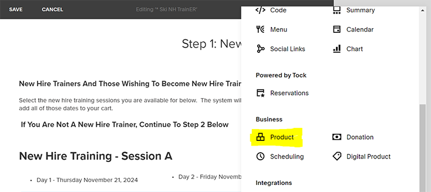
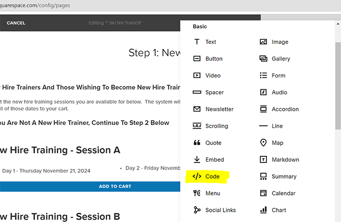
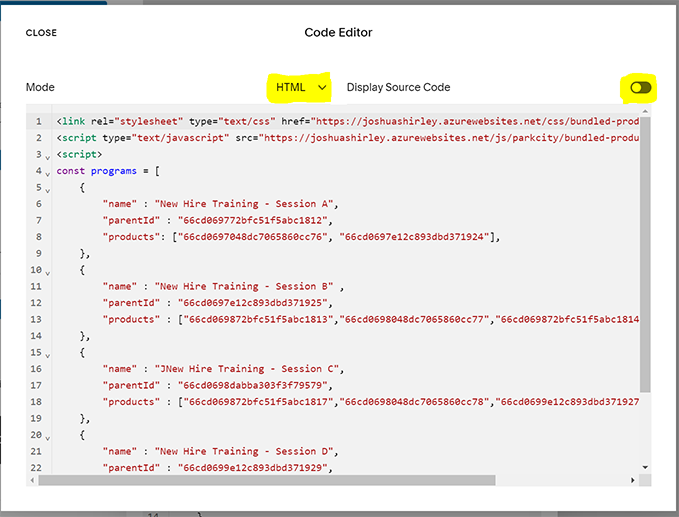

# Square Space 7.0 - Product Bundle How To

## Purpose
This script is capable of adding multiple products to the shopping cart at once.
The intended purpose is to mimick a bundled product.  
Adding one product will add all the children of bundled products along with the parent.
For example we want to add 13 class dates for a single weekend program.
The user adds one item - the script programmicattly adds all 13 individual products that make up the class.
The cart will then show 14 products: 1 parent and 13 add on products.

## Commerce Settings
To make a bundled product - with the square space admin page create a parent product and individual bundle products.

For example:
1. **Parent** - Fall 13 Saturday Dry Land Training Sessions
2. **Child** - Dry Land Training - Day 1
3. **Child** - Dry Land Training - Day 2
4. **Child** - Dry Land Training - Day 3
5. etc....

Add the parent product to the webpage.

Gather the productIDs for each of the products (parent and children).

### JSON Object

Build your bundled JSON.
This informs the JS code which products to add to the cart.  
The productIDs can be obtained by exporting the product list from the products management page.  
Admin -> Selling -> Products -> [Physical || Services || Downloads || Gift Cards] -> **Export All**  
Find the **ProductID** in the first column of the downloaded file.

    const bundledProducts = [
        { 
            "name" : "Parent Product Name", 
            "parentId" : "66cd069772bfc51f5abc1812",   
            "products": ["66cd0697048dc7065860cc76", "66cd0697e12c893dbd371924"],                
        },    
    ]

## Script Settings

Add a code block to the bottom of the page content.

  

Code Type: **HTML**  
Display Code: **Off**  

Inside the code block add the following scripts
1. **Cascading Style Sheet Reference**

`<link rel="stylesheet" type="text/css" href="https://joshuashirley.azurewebsites.net/css/bundled-products-v2.css">`

2. **JavaScript Reference**

``

3. **Implementation**

Add the following:

``